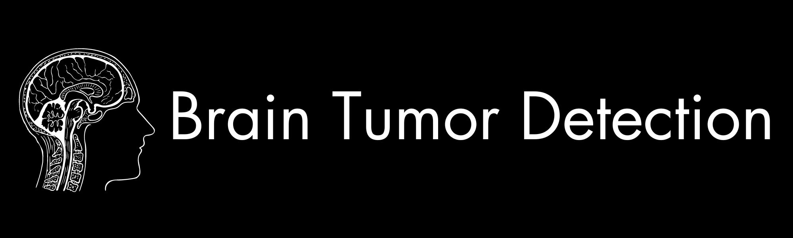
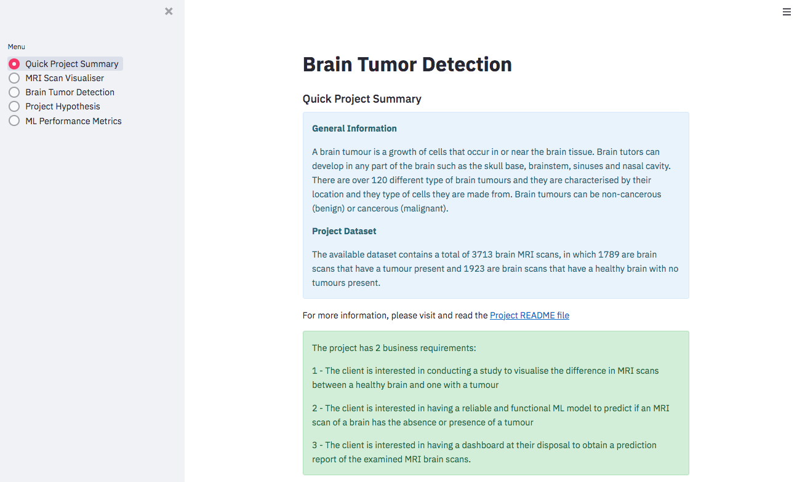
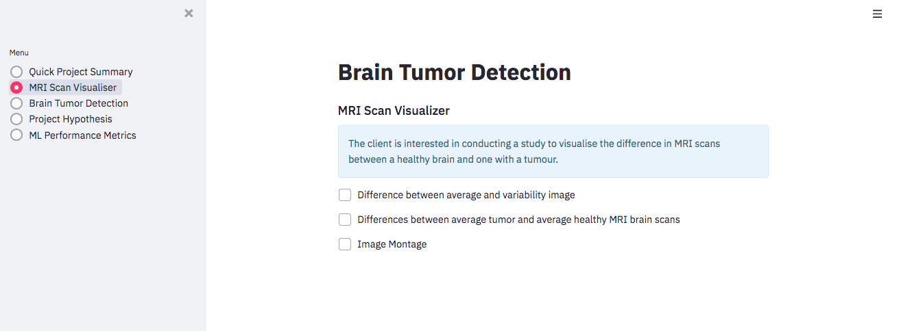
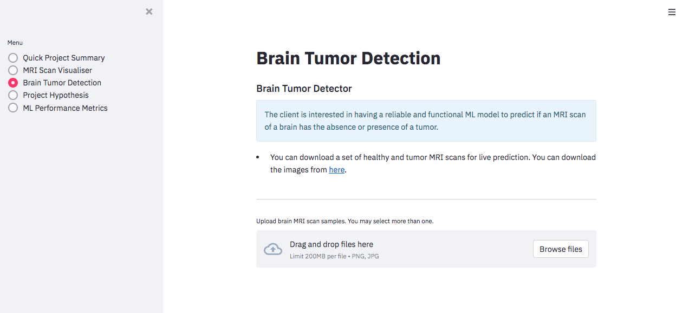
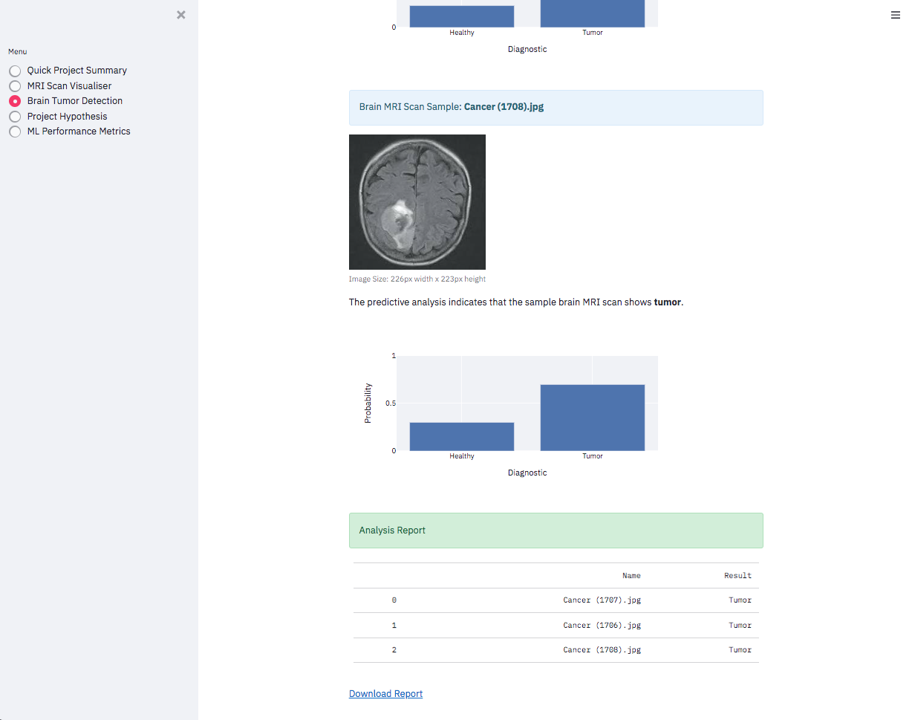
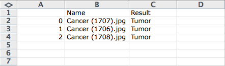
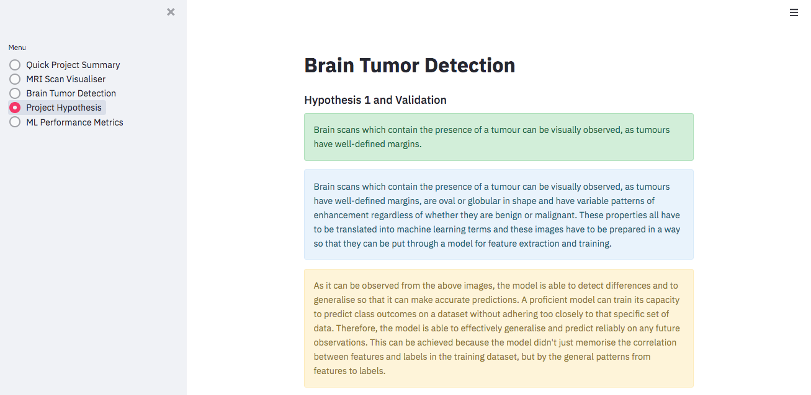
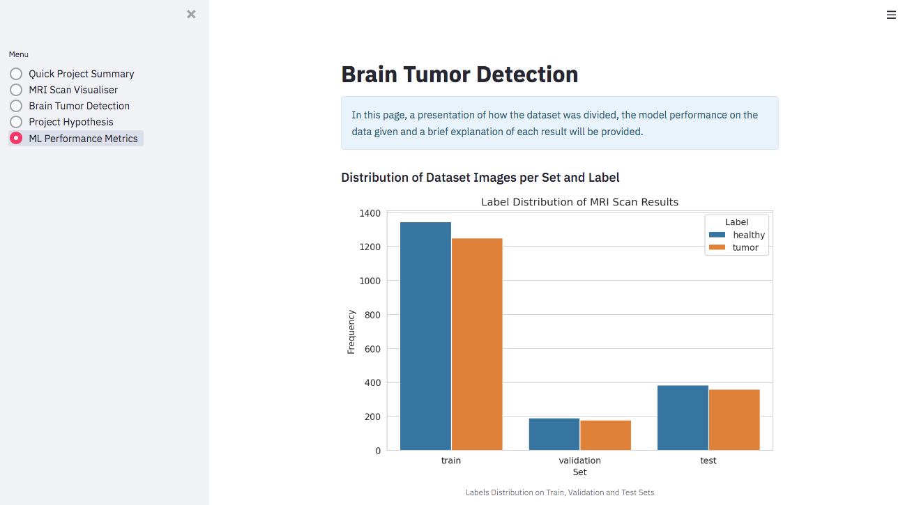

Deployed version [here](https://brain-tumor-detection-pp5-844e1e6ea166.herokuapp.com/)

## Dataset Content

The dataset contains a total of 3713 MRI scan images, in which they all consist of a single brain scan and all have a black background as all images are in black and white. These brain scan images are further broken down into 1923 healthy brain scans and 1789 scans of a brain in which a tumour is present. According to [Brain Tumour Research](https://braintumourresearch.org/blogs/campaigning/stark-facts#:~:text=We%20understand%20the%20power%20of%20statistics&text=Too%20many%20people%20are%20being,diagnosed%20with%20a%20brain%20tumour) in the UK, 16,000 people each year are diagnosed with a brain tumour. The dataset used in this project was sourced from [Kaggle](https://www.kaggle.com/datasets/preetviradiya/brian-tumor-dataset). 

## Business Requirements 

We have been tasked with developing a machine learning model to be able to detect the presence of brain tumours by using MRI scans. The requested system should be able to detect whether a given scan is healthy or has a tumour present, therefore altering medical staff that the patient needs further treatment. The system was requested by medical professionals to assist them in automating the detection of brain tumours. Medical professionals conduct thousands of brain MRI scans every year all across the country. As a result of this, a manual process is not scalable as more and more scans are being performed. 

The key stakeholders are: 

* Medical and healthcare professionals 
* Healthcare facilities, such as hospitals and clinics 
* Patients 
* Cancer research programs 

To summarise: 

* The client is interested in conducting a study to visualise the difference in MRI scans between a healthy brain and one with a tumour. 
* The client is interested in having a reliable and functional ML model to predict if an MRI scan of a brain has the absence or presence of a tumour. 
* The client is interested in having a dashboard at their disposal to obtain a prediction report of the examined MRI brain scans. 

## Hypothesis and Validation 

1. **Hypothesis:** Brain scans which contain the presence of a tumour can be visually observed, as tumours have well-defined margins.

    * **How to validate:** Research about brain tumours and build an average image study to help the investigation. 

2. **Hypothesis:** Comparing the difference between the Sigmoid and SoftMax activation functions.

    * **How to validate:** Understand the problem we are trying to solve for our client and how each of these activation functions can help us solve the problem. The same model will be trained and compared by only changing the activation function of the output layer. 

**Hypothesis 1**

"Brain scans which contain the presence of a tumour can be visually observed, as tumours have well-defined margins."

**Introduction**

Brain scans which contain the presence of a tumour can be visually observed, as tumours have well-defined margins, are oval or globular in shape and have variable patterns of enhancement regardless of whether they are benign or malignant. These properties all have to be translated into machine learning terms and these images have to be prepared in a way so that they can be put through a model for feature extraction and training. 

The mean and standard deviation is needed for the entire dataset to normalise the image. When dealing with an image dataset, the images need to be normalised before training a Neural Network on it. The are two core reasons as to why this is required: 

* To help the trained Neural Network give consistent results for the new test images. 

* Helps in transfer learning.

To calculate the mean and standard deviation of an image dataset, the four dimensions of the image are taken into consideration - B, C, H and W where: 

* B is batch size that is number of images 

* C is the number of channels in the image which will be three for RGB images 

* * H is the height of the image

* W is the width of the image 

The mean and standard deviation will be of one dimension with C values each for a channel. For RGB images, the mean will be a set of three values. Also, the standard deviation will be a set of three values. 

Therefore, mean and standard deviation is calculated separately for each channel. 

**Observations**

The below image montage shows the visual difference between healthy MRI scans and and those with the presence of a tumor. 

The below image shows the difference between average and variability of the images from a healthy MRI scans and those with the presence of a tumor. 

The below image shows the difference between an average healthy MRI scan and a tumor MRI scan

**Conclusion**

As it can be observed from the above images, the model is able to detect differences and to generalise so that it can make accurate predictions. A proficient model can train its capacity to predict class outcomes on a dataset without adhering too closely to that specific set of data. Therefore, the model is able to effectively generalise and predict reliably on any future observations. This can be achieved because the model didn’t just memorise the correlation between features and labels in the training dataset, but by the general patterns from features to labels. 

**Hypothesis 2**

“Comparing the difference between the Sigmoid and SoftMax activation functions.”

**Introduction**

Understanding the problem and the functions: 

To start, we need to understand the problem that we are trying to solve for our client and how the Sigmoid and SoftMax activation functions work. The model has to assign each MRI brain scan it is fed a label of either healthy or tumour, a choice from two categories. It can be seen as one of two ways, firstly, as binary classification, also called logistic regression which categorises new observations into one of two classes (“no tumour” = 0, “tumour” = 1’). Secondly, as multi-class logistic regression which will recorgnise if the MRI scan is healthy or has the presence of a tumour. It must be noted that the must be either “healthy” or “tumour”, and cannot be both, therefore the two classes are mutually exclusive. 

If we view the problem to solve as a binary classification, only one node will be used for the output as probabilities should only relate to only one class. The output from the final layer of the neural network will be transformed into a probability for each class. By using the Sigmoid function, the output can be interpreted as a probability and mark all greater or equal to 0.5 as a classification of 1 (tumour) and all other predictions less than 0.5 as a classification of 0 (healthy). The Sigmoid function is also called the squashing function as its domain is the set of all real numbers, and its range is (0, 1). Therefore, if the input is a very large negative number, a very large positive number or any number between –∞ and +∞, the output will always be between 0 and 1. 

If we view the problem as multi-class, two nodes will be used for the output as we want to predict on two classes (healthy and tumour). For a multi-class classification, the SoftMax function will be used for the output layer. When the SoftMax function is used in the output layer, it is possible to translate the numbers into a probability distribution. Just like the Sigmoid function, it will be in the range (0, 1), but in this case the probabilities will add up to 1. 

Understand and compare the difference between the two functions:

To understand how both the Sigmoid and SoftMax functions perform, learning curves were plotted and we’ll be observing these plots in the next section. Learning curves are widely used as a diagnostic tool in machine learning for algorithms that learn from a training dataset. The model can be evaluated on the training dataset and on a hold out validation dataset after each update during training and plots of the measured performance can be created to show learning curves. By reviewing the learning curves of the model, we can observe if there are any issues, such as an underfit or overfit model. 

For the learning curve plots shown in the observation section below, what we are looking for is a good fit, as this is the goal of the learning algorithm and exists between an overfit and underfit model. A good fit can be identified by a training and validation loss that decreases to a point of stability with a minimal gap between the two final loss values. When observing a learning curve, the loss of the model will almost always be lower on the training dataset than the validation dataset. This implies that there will be some gap between the train and validation loss learning curves. This gap is known as the “generalisation gap”. 

A good fit learning curve plot has the following characteristics: 

* The plot of training loss decreases to a point of stability. 

* The plot of validation loss decreases to a point of stability and has a small gap with the training loss.

**Observation**

To observe the learning curve plots for both Sigmoid and SoftMax, the following was done for both functions to ensure a fair result: 

* Epochs set to the same amount 

* All other hyperparaments were set to the same parameters 

* Early stopping was set

The image below shows the Loss/Accuracy Curve using the SoftMax function:

The image below shows the model accuracy using the SoftMax function:

The image below shows the Loss/Accuracy Curve using the Sigmoid function:

The image below shows the model accuracy using the Sigmoid function:

**Conclusion**

As it can be observed from the above plots and the accuracy percentage, it is clear that the SoftMax function performed best. It had some overfitting on the plot but we can see that we achieved an accuracy of over 82%. 

## The rational to map the business requirements to the Data Visualisations and ML tasks

All three business requirements that were set out in a previous section called “Business Requirements”, have been split into several user stories which were translated into Machine Learning Tasks. 

**Business Requirement 1: Data Visualisation**

“The client is interested in conducting a study to visualise the difference in MRI scans between a healthy brain and one with a tumour.”

User Stories: 
* As a client, I want an interactive dashboard that is easy to navigate so that I can view and understand the data which has been presented. 

* As a client, I want the mean and the standard deviation to be displayed for images that display a healthy scan and a tumour scan, so that I can visually differentiate the MRI scans.

* As a client, I want to display the difference between an MRI scan that is of a healthy brain and an MRI scan of a brain that has the presence of a tumour, so that I can visually differentiate the MRI scans.

* As a client, I want to display an image montage for MRI scans that are healthy and that have the presence of a tumour, so that I can visually differentiate the MRI scans. 

**Business Requirement 2: Classification**

“The client is interested in having a reliable and functional ML model to predict if an MRI scan of a brain has the absence or presence of a tumour.”

User Story: 

* As a client, I want to upload image(s) of the MRI scan results, so that the ML model can give me an immediate and accurate prediction on whether the image is healthy or has a tumour. 

**Business Requirement 3: Reporting**

“The client is interested in having a dashboard at their disposal to obtain a prediction report of the examined MRI brain scans.”

User Story: 

* As a client, I want to obtain a report from the ML predictions on new MRI scans.

## ML Business Case 

* The client is looking for an ML model that can detect if a brain MRI scan has the presence of a tumour or not. 

* The aim is to provide the stakeholders with a fast and reliable detector for brain tumours. 

* The output from the model will be a classification label which will indicate if the MRI scan is healthy or tumour. 

* Heuristics: At present, all MRI scans are inspected manually. In the UK, patients have to wait an average of 1-2 weeks before getting their MRI scan results. By healthcare professionals using this ML model, we can expect patients to get their diagnosis quicker. 

* Initially, the evaluation of the success of this model will be based on the accuracy percentage displayed once the model has been trained. 

* A more pinpointed level of accuracy will be put forward by the stakeholders, but it should be noted that the dataset that is provided could have limitations. As the accuracy of the model increases, the level of service and care to the patient will also increase. 

* Although an ML accuracy between 70-90% is considered good, in healthcare a level of 97% or greater must be reached. This can ensure that a correct medical diagnosis is achieved. 

## Dashboard Design 

This project is presented via Streamlit, which is a dashboard web application. It consists of five pages and the client can navigate throughout these pages by using the menu on the left-hand side. The pages consist of the following: 

**Page 1: Quick Project Summary**

This page will have the following information: 

* General information about brain tumours - what they are and how many types exist. 

* How many brain MRI scan images the dataset contains - both for healthy and tumour. 

* The three business requirements. 

* A link to the full README file for more information. 

Click to View Quick Project Summary Page

**Page 2: MRI Scan Visualiser**

This page will answer business requirement #1, therefore it will have the following checkboxes so our client can pick what they see on the page: 

* Checkbox #1 - This will show the difference between average and variability image 

* Checkbox #2 - This will show the differences between average tumour and average healthy MRI brains scans 

* Checkbox #3 - This will show an image montage

Click to View MRI Scan Visualiser Page

**Page 3: Brain Tumor Detection**

This page will answer business requirements 2 and 3, where the client wants to have a reliable and functional ML model to predict if MRI scans of brains are healthy or have the presence of a tumor and to obtain a downloadable report with the results. The following should be conducted to obtain results: 

* Download the dataset with healthy and tumor MRI brain scans from Kaggle here

* As the streamlit application has a user friendly dashboard, the images can be either selected from file by browsing or dragged and dropped. 

* Once images are in, each image will display the bar graph underneath with a visual representation of the prediction and a prediction statement, stating whether the MRI scan shows healthy or tumor. 

* Towards the bottom of the page there will be an analysis report table which will have the name of the images uploaded and the prediction results. 

* Below the analysis report table there will be a link to download the report in a csv format. 

Click to View Brain Tumor Detection Page

**Page 4: Project Hypothesis**

This page will contain: 

* An overview of all the hypotheses and the validation that were previously described in a previous section of this README. 

* A link to the README page so any stakeholder can click and read about the hypothesis and validation more in-depth. 

Click to View Project Hypothesis Page

**Page 5: ML Performance Metrics**

This page will contain all the performance metrics from the ML model, this includes: 

* Label frequencies for train, validation and test sets. 

* Distribution percentage of MRI scan labels (Healthy & Tumour) across the dataset 

* Model History - Accuracy and Loss of the model 

* Model Accuracy - Confusion matrix 

* Model evaluation result on test set 

Click to View ML Performance Metrics Page

## Testing

### Manual Testing

Testing for Business Requirement #1:

*The client is interested in conducting a study to visualise the difference in MRI scans between a healthy brain and one with a tumour.*

| Description                                                                              | Action                                                                                                  | Expected Result                                                                                             | Pass/Fail |
| ---------------------------------------------------------------------------------------- | ------------------------------------------------------------------------------------------------------- | ----------------------------------------------------------------------------------------------------------- | --------- |
| Test the navigation bar to ensure it navigates to the correct page                       | Testing was performed by clicking on each of the options one the navigation menu                         | All navigation links get directed to the correct pages                                                      | Pass      |
| Test that both the mean and standard deviation are displayed for healthy and tumor scans | Testing was performed by navigating to the MRI scan visualiser page and clicking on the first checkbox  | The mean and standard deviation for the healthy and tumor images are displayed once the checkbox is clicked | Pass      |
| Test that the difference in a healthy MRI scan and a tumor MRI scan can be displayed     | Testing was performed by navigating to the MRI scan visualiser page and clicking on the second checkbox | The images differences in the images from healthy and tumor are displayed once the checkbox is clicked      | Pass      |
| Test that an image montage is displayed                                                  | Testing was performed by navigating to the MRI scan visualiser page and clicking on the third checkbox  | The image montage is displayed once the the checkbox is clicked                                             | Pass      |

Testing for Business Requirement #2:

*The client is interested in having a reliable and functional ML model to predict if an MRI scan of a brain has the absence or presence of a tumour.*

| Description                              | Action                                                                                                               | Expected Result                                                                                                                                                                                       | Pass/Fail |
| ---------------------------------------- | -------------------------------------------------------------------------------------------------------------------- | ----------------------------------------------------------------------------------------------------------------------------------------------------------------------------------------------------- | --------- |
| Test that multiple images can be uploaded | Testing was performed by navigating to the Brain Tumor Detection page, dragging and dropping three images to analyse | All images will immediately be analysed with a bar chart each on showing a visual representation of the prediction. An analysis report table will also be displayed with all image names and results. | Pass      |

Testing for Business Requirement #3:

*The client is interested in having a dashboard at their disposal to obtain a prediction report of the examined MRI brain scans.*

| Description                                           | Action                                                                                                                                              | Expected Result                                                                                                 | Pass/Fail |
| ----------------------------------------------------- | --------------------------------------------------------------------------------------------------------------------------------------------------- | --------------------------------------------------------------------------------------------------------------- | --------- |
| Test that the analysis report table can be downloaded | Once the images have been been predicted on, below the analysis report table there will be a clickable link which will promt a csv file to download | A csv file will download on the machine and the results will be the same as those stated on the analysis report | Pass      |

### Automated Testing

No automated unit testing was performed, this will be scheduled for the next release. 

## Deployment 

Live link to the app: [Brain Tumor Detection](https://brain-tumor-detection-pp5-844e1e6ea166.herokuapp.com/)

### Heroku 

These are the steps needed to successfully deploy the project to Heroku: 

* Set the runtime.txt Python version to a Heroku-20 stack currently supported version. 

* Make sure any recent changes are pushed to GitHub. 

* Log into Heroku and select ‘Create a new app’. 

* Enter a unique app name and select your region, then click ‘Create app’. 

* In the ‘Deploy’ tab, select GitHub in Deployment method, connect to GitHub and search for the project repository. 

* Select the branch you want to deploy and then click ‘Deploy Branch’.

* Wait for the logs to run as the app is being built.

* If the slug size is too large then add large files not required for the app to the slugignore file. 

### Fork Project

Most commonly, forks are used to either propose changes to someone else’s project or to use someone else’s project as a starting point for your own idea. You can fork a project by doing the following:

* Navigate to the GitHub Repository you want to fork

* Not he top right of the page under the header, click the fork button

* This will create a duplicate of the full project in your GitHub Repository

### Clone the Repository Code Locally

To clone the Github repository to use locally, the following will have to be done: 

* Click on the green Code button, which has a drop down menu

* Click on HTTPS

* Copy the repository link that's on the clipboard

* Open an IDE of your choice (note: git must be installed for the next steps)

* Type git clone copied-git-url into the terminal of the IDE

* Once these steps are followed, the project will be cloned on your local machine ready for use.
